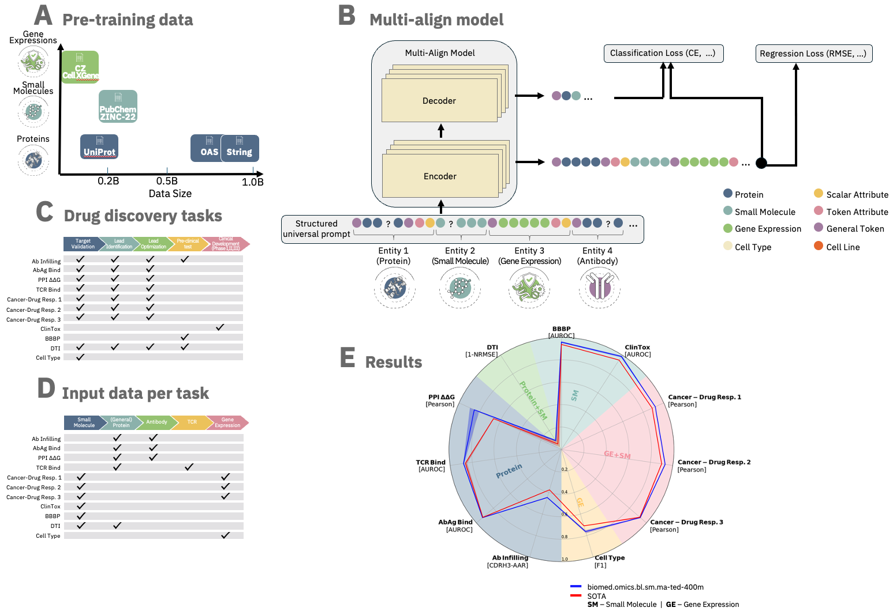

# biomed-multi-alignment

We introduce [**ibm/biomed.omics.bl.sm.ma-ted-458m**](https://arxiv.org/abs/2410.22367).
A biomedical foundation model trained on over 2 billion biological samples across multiple modalities, including proteins, small molecules, and single-cell gene expression data.
Designed for robust performance, it achieves state-of-the-art results on a variety of tasks across the entire drug discovery pipeline and diverse biomedical domains.

The model is based on **MAMMAL** (**M**olecular **A**ligned **M**ulti-**M**odal **A**rchitecture and **L**anguage), a flexible, multi-domain architecture with an adaptable task prompt syntax.
The syntax allows for dynamic combinations of tokens and scalars, enabling classification, regression, and generation tasks either within a single domain or with cross-domain entities.

The model weights are stored at https://huggingface.co/ibm/biomed.omics.bl.sm.ma-ted-458m and the MAMMAL core code together with fine-tuning and inference can be found in this repo.
Learn more by reading our [pre-print](https://arxiv.org/abs/2410.22367).



## Installation
MAMMAL is tested on Python >= 3.10 and PyTorch >= 2.0

Follow the next steps to install MAMMAL in a new environment:
1. Create conda environment:
    ```
    conda create -n mammal_env python=3.10 -y
    conda activate mammal_env
    ```

2. Install PyTorch: (see [here](https://pytorch.org/get-started/locally/)). For example:
   ```
   conda install pytorch pytorch-cuda=12.1 -c pytorch -c nvidia
   ```

3. Install the package in [editable mode](https://pip.pypa.io/en/stable/topics/local-project-installs/#editable-installs) using `pip`:
   ```
   git clone git@github.com:BiomedSciAI/biomed-multi-alignment.git
   pip install -e ./biomed-multi-alignment[examples]
   ```


# Examples
We provide a variety of example tasks, covering one from each domain as well as a multi-domain task. To facilitate easy setup, we've selected tasks with datasets that can be automatically downloaded and come with established data splits.
While these tasks may not necessarily have State-of-the-Art results we can compare to, they offer practical demonstrations of model application.

Additionally, since the pre-trained model was also trained on a protein-protein interaction task, we demonstrate inference using this task with ibm/biomed.omics.bl.sm.ma-ted-458m.

## Protein-Protein Interaction
A simple example for a task already supported by `ibm/biomed.omics.bl.sm.ma-ted-458m`:
```python
import torch
from fuse.data.tokenizers.modular_tokenizer.op import ModularTokenizerOp
from mammal.model import Mammal
from mammal.keys import *

# Load Model
model = Mammal.from_pretrained("ibm/biomed.omics.bl.sm.ma-ted-458m")
# Set model to evaluation mode
model.eval()

# Load Tokenizer
tokenizer_op = ModularTokenizerOp.from_pretrained("ibm/biomed.omics.bl.sm.ma-ted-458m")

# Prepare Input Prompt
protein_calmodulin = "MADQLTEEQIAEFKEAFSLFDKDGDGTITTKELGTVMRSLGQNPTEAELQDMISELDQDGFIDKEDLHDGDGKISFEEFLNLVNKEMTADVDGDGQVNYEEFVTMMTSK"
protein_calcineurin = "MSSKLLLAGLDIERVLAEKNFYKEWDTWIIEAMNVGDEEVDRIKEFKEDEIFEEAKTLGTAEMQEYKKQKLEEAIEGAFDIFDKDGNGYISAAELRHVMTNLGEKLTDEEVDEMIRQMWDQNGDWDRIKELKFGEIKKLSAKDTRGTIFIKVFENLGTGVDSEYEDVSKYMLKHQ"

# Create and load sample
sample_dict = dict()
# Formatting prompt to match pre-training syntax
sample_dict[ENCODER_INPUTS_STR] = f"<@TOKENIZER-TYPE=AA><BINDING_AFFINITY_CLASS><SENTINEL_ID_0><MOLECULAR_ENTITY><MOLECULAR_ENTITY_GENERAL_PROTEIN><SEQUENCE_NATURAL_START>{protein_calmodulin}<SEQUENCE_NATURAL_END><MOLECULAR_ENTITY><MOLECULAR_ENTITY_GENERAL_PROTEIN><SEQUENCE_NATURAL_START>{protein_calcineurin}<SEQUENCE_NATURAL_END><EOS>"

# Tokenize
tokenizer_op(
    sample_dict=sample_dict,
    key_in=ENCODER_INPUTS_STR,
    key_out_tokens_ids=ENCODER_INPUTS_TOKENS,
    key_out_attention_mask=ENCODER_INPUTS_ATTENTION_MASK,
)
sample_dict[ENCODER_INPUTS_TOKENS] = torch.tensor(sample_dict[ENCODER_INPUTS_TOKENS])
sample_dict[ENCODER_INPUTS_ATTENTION_MASK] = torch.tensor(sample_dict[ENCODER_INPUTS_ATTENTION_MASK])

# Generate Prediction
batch_dict = model.generate(
    [sample_dict],
    output_scores=True,
    return_dict_in_generate=True,
    max_new_tokens=5,
)

# Get output
generated_output = tokenizer_op._tokenizer.decode(batch_dict[CLS_PRED][0])
print(f"{generated_output=}")
```

## Protein solubility prediction
Protein solubility is a critical factor in both pharmaceutical research and production processes, as it can significantly impact the quality and function of a protein.
This is an example for finetuning `ibm/biomed.omics.bl.sm-ted-458` for protein solubility prediction (binary classification) based solely on the amino acid sequence.
The benchmark is defined in: https://academic.oup.com/bioinformatics/article/34/15/2605/4938490
Data was retrieved from: https://zenodo.org/records/1162886


### Finetune
To finetune from pre-trained MAMMAL, run the following command:
```
python mammal/main_finetune.py --config-name config.yaml --config-path  examples/protein_solubility
```
### Inference
To run inference, run the following command:
```
python mammal/examples/protein_solubility/main_infer.py <path to finetune output dir> <amino acid sequence of protein>
```
### Evaluation
To run the evaluation, use the following command:
```
python mammal/main_finetune.py --config-name config.yaml --config-path  examples/protein_solubility evaluate=True model.pretrained_kwargs.pretrained_model_name_or_path=<path to finetune output dir>/best_epoch.ckpt
```

## Drug carcinogenicity prediction
A [TDC task](https://tdcommons.ai/single_pred_tasks/tox/#carcinogens) of a binary classification. Given a drug SMILES string, predict whether it can cause cancer.
> A carcinogen is any substance, radionuclide, or radiation that promotes carcinogenesis, the formation of cancer. This may be due to the ability to damage the genome or to the disruption of cellular metabolic processes.

### Finetune
To finetune from pre-trained MAMMAL, run the following command:
```
python mammal/main_finetune.py --config-name config.yaml --config-path  examples/carcinogenicity
```
### Inference
To run inference, run the following command:
```
# python mammal/examples/carcinogenicity/main_infer.py <path to finetune output dir> <drug sequence>
python mammal/examples/carcinogenicity/main_infer.py ./carcinogenicity_finetune "CC(CCl)OC(C)CCl"
```

## Drug Target Interaction
Accurate prediction of drug-target binding affinity is essential in the early stages of drug discovery.
This is an example of finetuning `ibm/biomed.omics.bl.sm-ted-458` the task.
Prediction of binding affinities using pKd, the negative logarithm of the dissociation constant, which reflects the strength of the interaction between a small molecule (drug) and a protein (target).
The expected inputs for the model are the amino acid sequence of the target and the SMILES representation of the drug.
The benchmark defined on: https://tdcommons.ai/multi_pred_tasks/dti/
We also harmonize the values using `data.harmonize_affinities(mode = 'max_affinity')` and transforming to log-scale.
By default we are using Drug+Target cold-split, as provided by tdcommons.

### Finetune
To finetune from pretrained MAMMAL, run the following command:
```
python mammal/main_finetune.py --config-name config.yaml --config-path  examples/dti_bindingdb_kd
```
### Inference
To run inference, run the following command:
```
python mammal/examples/dti_bindingdb_kd/main_infer.py <path to finetune output dir> <amino acid sequence of target>  <smiles representation of a drug> <norm_y_mean> <norm_y_std>
```
`<norm_y_mean>` and `<norm_y_std>` should be the values specified in the finetuning configuration file (config.yaml).
### Evaluation
To run the evaluation, run the following command:
```
python mammal/main_finetune.py --config-name config.yaml --config-path  examples/dti_bindingdb_kd evaluate=True model.pretrained_kwargs.pretrained_model_name_or_path=<path to finetune output dir>/best_epoch.ckpt
```

# Modular Tokenizer
Since many of the tasks on which **ibm/biomed.omics.bl.sm.ma-ted-458m** is trained use different modalities (amino acid sequences, SMILES, gene expressions, etc.), we implemented a modular tokenizer that can combine multiple tokenizers, mapping their dictionaries to a consistent ID space (https://github.com/BiomedSciAI/fuse-med-ml/tree/master/fuse/data/tokenizers/modular_tokenizer).

# Tutorials
If you are interested in a specific guide / tutorial, feel free to [open an issue](https://github.com/BiomedSciAI/biomed-multi-alignment/issues/new).
### Beginner
* TBD
### Advanced
* Create a new Mammal task. [[link](./tutorials/advanced_create_new_task.ipynb)]


# Citations
If you find our work useful for your research, we ask you to cite the relevant papers:
```
@misc{shoshan2024mammalmolecularaligned,
      title={MAMMAL -- Molecular Aligned Multi-Modal Architecture and Language},
      author={Yoel Shoshan and Moshiko Raboh and Michal Ozery-Flato and Vadim Ratner and Alex Golts and Jeffrey K. Weber and Ella Barkan and Simona Rabinovici-Cohen and Sagi Polaczek and Ido Amos and Ben Shapira and Liam Hazan and Matan Ninio and Sivan Ravid and Michael M. Danziger and Joseph A. Morrone and Parthasarathy Suryanarayanan and Michal Rosen-Zvi and Efrat Hexter},
      year={2024},
      eprint={2410.22367},
      archivePrefix={arXiv},
      primaryClass={q-bio.QM},
      url={https://arxiv.org/abs/2410.22367},
}
```
